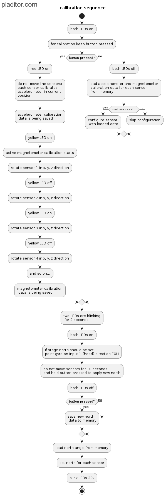

This is a general overview and starting point for the artes mobiles controller firmware(s).
The code is based on arduino libaries and is intendet to run on an ESP32 board.
The leading codebase is "OneESP_SixMPU9250". The others may or may not be updated to have
all the features/functionality.

# Basic steps

1. Install platform.io for compiling the code

   python3 -m venv venv && ./venv/bin/pip install --upgrade pip setuptools && . ./venv/bin/activate
   pip install -U platformio

2. Change into firmware directory (where the platformio.ini file resides) and build it. The first run will install the toolchain automatically.

   pio run

3. Install udev rules: https://docs.platformio.org/en/latest/core/installation/udev-rules.html

3.1. Download rules from https://raw.githubusercontent.com/platformio/platformio-core/develop/platformio/assets/system/99-platformio-udev.rules
3.2. Inspect 99-platformio-udev.rules for configuration collisions
3.3. Copy rules: sudo cp 99-platformio-udev.rules /etc/udev/rules.d/99-platformio-udev.rules
3.4. Reload rules: sudo service udev restart

4. Attach controller to USB

5. Upload firmware to device

   pio run -t upload

   maybe specify USB port explicitly via: --upload-port=/dev/ttyUSB0

6. Use doxygen to generate in-depth firmware documentation

   doxygen DoxyFile

# Calibration procedure
The sensors need to be calibrated when at a new location. The procedure
follows the following steps:

# Previous production code
The codebase up until 37b29a788d612b3fe45e6455e0f8cc0fa5f2ee93 (the last documentation commit is d4299a8ecae315ee831c7e43cf189bb9288b855f)
is soley based on the old prototyped boards.

# References

* [platform.io](https://platformio.org/)
* [doxygen](https://www.doxygen.nl/)
